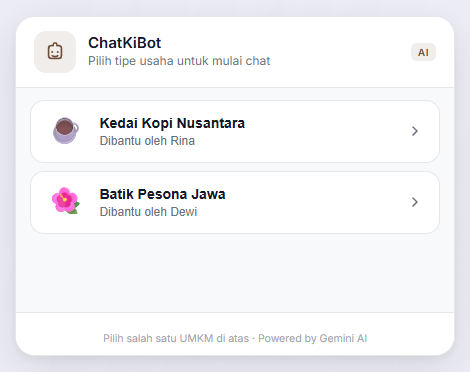
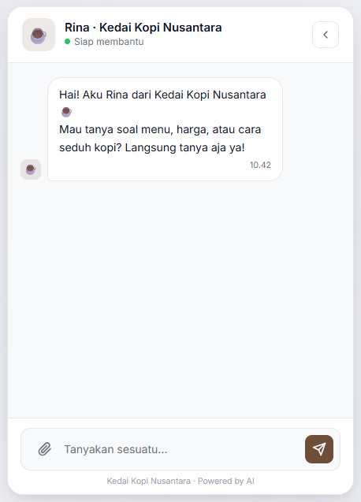
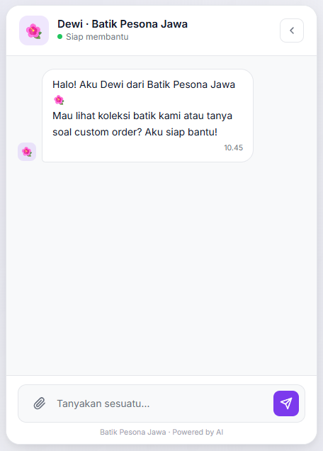
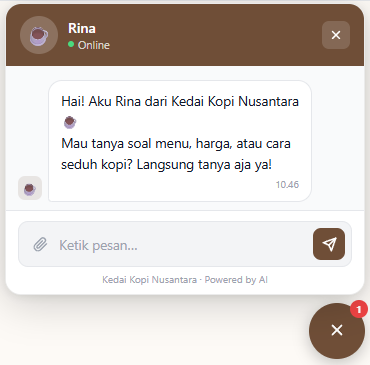
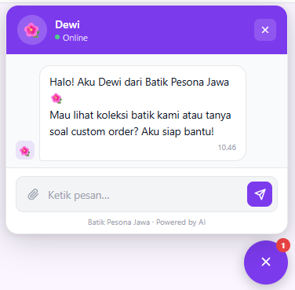

# ChatKiBot

Widget chat AI untuk website UMKM. Muncul di pojok kanan bawah halaman, ditenagai Gemini dengan persona dan data produk yang bisa dikonfigurasi sendiri. Satu server bisa handle banyak bisnis sekaligus, masing-masing punya persona AI, katalog produk, dan warna tema sendiri.

---

## Demo

**Halaman utama**, pilih bisnis sebelum mulai chat:



**Tampilan chat di web:**

<table>
  <tr>
    <td></td>
    <td></td>
  </tr>
  <tr>
    <td align="center">Kedai Kopi Nusantara · Rina</td>
    <td align="center">Batik Pesona Jawa · Dewi</td>
  </tr>
</table>

**Widget embed di website:**

<table>
  <tr>
    <td></td>
    <td></td>
  </tr>
  <tr>
    <td align="center">Kedai Kopi Nusantara</td>
    <td align="center">Batik Pesona Jawa</td>
  </tr>
</table>

---

## Requirement

- Node.js 18+
- Gemini API Key (gratis di [Google AI Studio](https://aistudio.google.com))

---

## Setup

```bash
git clone <repo-url>
cd chatkibot
npm install
```

Buat file `.env` dari contoh yang sudah ada:

```bash
cp .env.example .env
```

Isi API key di `.env`:

```
GEMINI_API_KEY=isi_api_key_di_sini
```

Jalankan:

```bash
npm start
```

Buka `http://localhost:3000`, ada selector untuk memilih bisnis (Kedai Kopi dan Toko Batik) yang sudah siap dicoba. Atau buka `http://localhost:3000/demo.html` untuk preview widget langsung.

---

## Pasang di website

Taruh ini sebelum `</body>`:

```html
<script
  src="http://localhost:3000/widget/widget.js"
  data-business-id="kedai-kopi-nusantara"
  data-api-url="http://localhost:3000">
</script>
```

Ganti `localhost:3000` dengan domain server setelah deploy, dan `kedai-kopi-nusantara` dengan ID bisnis yang sesuai. Atribut `data-api-url` wajib diisi saat domain widget berbeda dari domain server. Widget langsung muncul tanpa perlu tambah CSS atau HTML lain.

---

## Tambah bisnis baru

Edit `src/config/businesses.js`, copy salah satu blok yang sudah ada, dan sesuaikan:

```js
'nama-bisnis': {
    businessId: 'nama-bisnis',
    businessName: 'Nama Toko',
    agentName: 'Sari',
    agentAvatar: '🛍️',
    primaryColor: '#16A34A',
    welcomeMessage: 'Halo! Ada yang bisa dibantu?',
    footerText: 'Nama Toko · Powered by AI',
    sessionTtlMinutes: 60,

    persona: `Kamu adalah Sari, CS Nama Toko.
Ramah, to the point, dan paham produk toko ini luar dalam.
Pakai bahasa santai. Jangan bertele-tele.`,

    products: [
        { name: 'Nama Produk', price: 50000, unit: 'pcs', stock: 30, description: 'Deskripsi singkat' },
    ],

    businessInfo: {
        hours: 'Senin–Sabtu 08.00–17.00',
        location: 'Alamat toko',
        phone: '0812-xxxx-xxxx',
        instagram: '@namatoko',
        payment: 'Transfer, QRIS',
    },
},
```

Simpan, restart server, dan widget sudah siap dipakai.

---

## Persona AI

Field `persona` adalah instruksi bebas yang langsung dikirim ke Gemini. Semakin spesifik, semakin konsisten perilaku AI-nya.

Yang bisa diatur:
- **Identitas**: nama, latar belakang ("udah 5 tahun kerja di sini")
- **Gaya bicara**: formal, santai, pakai sapaan Kak/Bang, dll.
- **Skenario produk habis**: tawarkan alternatif, minta WA customer, dll.
- **Batasan topik**: hanya soal produk, atau boleh lebih luas
- **Closing**: arahkan ke WA, telepon, atau kunjungan langsung

---

## Struktur project

```
├── index.js
├── src/
│   ├── config/
│   │   ├── gemini.js               # inisialisasi Gemini SDK (model: gemini-2.5-flash)
│   │   └── businesses.js           # konfigurasi semua bisnis
│   ├── controllers/
│   │   ├── generateController.js
│   │   └── widgetController.js
│   └── routes/
│       ├── generate.js
│       └── widget.js
└── public/
    ├── index.html                  # halaman utama dengan selector bisnis
    ├── demo.html                   # preview widget embed
    ├── css/
    │   └── style.css
    ├── js/
    │   └── script.js
    └── widget/
        └── widget.js               # script embeddable
```

---

## API

| Method | URL | Keterangan |
|--------|-----|------------|
| `GET` | `/widget/businesses` | Daftar semua bisnis yang terdaftar |
| `GET` | `/widget/config/:businessId` | Config publik bisnis (nama, warna, avatar) |
| `POST` | `/widget/chat` | Kirim pesan teks ke AI |
| `POST` | `/widget/chat/file` | Kirim pesan + file (gambar/PDF/audio) ke AI |
| `POST` | `/generate-text` | Generate teks bebas |

### Contoh request, chat teks

```js
fetch('http://localhost:3000/widget/chat', {
    method: 'POST',
    headers: { 'Content-Type': 'application/json' },
    body: JSON.stringify({
        businessId: 'kedai-kopi-nusantara',
        messages: [
            { role: 'user', content: 'Kopi apa yang paling laris?' }
        ]
    })
})
```

```json
{
    "response": "Es Kopi Susu kami yang paling laku, hampir tiap hari habis sebelum sore hehe..."
}
```

Untuk multi-turn, kirim semua history di array `messages`. Server otomatis potong di 20 pesan terakhir.

### Contoh request, chat dengan file

```js
const form = new FormData();
form.append('businessId', 'kedai-kopi-nusantara');
form.append('messages', JSON.stringify([
    { role: 'user', content: 'Ini gambar produk kami, bisa bantu buat deskripsinya?' }
]));
form.append('file', fileInput.files[0]); // gambar, PDF, atau audio

fetch('http://localhost:3000/widget/chat/file', {
    method: 'POST',
    body: form,
})
```

Tipe file yang didukung: gambar (JPEG/PNG/GIF/WEBP), PDF, dan audio (MP3/WAV/OGG/AAC/FLAC/WEBM). Ukuran maksimum 10 MB.

---

## Deploy

Tidak ada config khusus. Pastikan `GEMINI_API_KEY` tersedia di environment server, lalu `npm start`.

Untuk production, pakai PM2:

```bash
npm install -g pm2
pm2 start index.js --name umkm-widget
pm2 save
```

Setelah deploy, ganti `localhost:3000` di embed code dengan domain server.

---

## 📄 Lisensi / License

Karsa Wave - MIT + Commons Clause

Kode ini bebas digunakan, dimodifikasi, dan didistribusikan. Namun, menjual kode ini sebagai produk utama dalam bentuk asli maupun dengan perubahan minor adalah pelanggaran lisensi. Penjualan hanya diperbolehkan jika kode ini menjadi bagian kecil dari produk yang lebih besar dengan nilai tambah nyata bagi pengguna.

Kode ini disediakan "apa adanya" tanpa jaminan dalam bentuk apapun. Karsa Wave tidak bertanggung jawab atas kerugian yang timbul dari penggunaannya.

---

Karsa Wave - MIT + Commons Clause

Free to use, modify, and distribute. However, selling this code as a primary product original or minimally modified is a license violation. Sale is only permitted when this code is a minor part of a larger product with real added value for the end user.

This code is provided "as is" without any warranty. Karsa Wave is not liable for any damages arising from its use.
